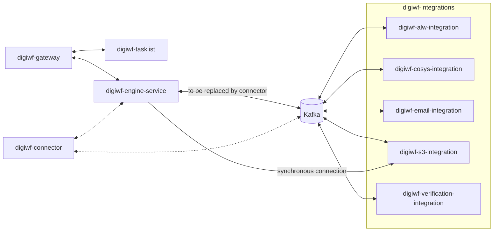
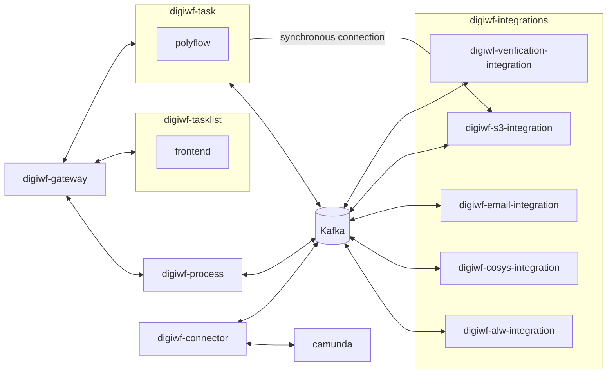

# Development

**Current state**

**Future state**

## Local Setup

For local development you have to start the digiwf-tasklist (the vue and vuetify based frontend application), the digiwf-engine-service (spring-boot and camunda based backend application) and the digiwf-gateway.
Additionally, you can start the digiwf-integrations if you need features from any of the integration services.

**Setup a local dev environment**

You can use the docker-compose [stack](stack) to start all the necessary infrastructure components (like e.g. kafka and minio).

**Applications and profiles**

To start any of the applications you can use the profiles:

* `local` for local development settings
* `streaming` to enable event streaming to kafka

Additionally, you can use the following profiles to disable a few features to simplify development:

* `no-security` to disable spring security
* `no-mail` to prevent the applications from sending emails
* (only digiwf-engine-service) `no-ldap` to use a *fake* user service instead of the actual lhm ldap

## Release a new version

### Building a new maven version

For updating the version of the project we use maven-versions plugin.

#### update new patch version

1. run `mvn versions:set -DprocessAllModules -DnextSnapshot`
2. check if update is correct
3. if update is correct, run `mvn versions:commit` otherwise run `mvn versions:revert`

#### update to a specific version

1. run `mvn versions:set -DprocessAllModules -DnewVersion=<your version>`
2. check if update is correct
3. if update is correct, run `mvn versions:commit` otherwise run `mvn versions:revert`

### Deploy a new maven version

- Execute the release pipeline manually and set `Release services (y/n)?` to `y`
- `-SNAPSHOT` will be removed automatically by the pipeline if `Snapshot build (y/n)?` is set to `n`

### Deploy a new apps version

- execute `npm run versioning` in the digiwf-apps folder
- Execute the release pipeline manually and set `Release apps (y/n)?` to `y`
- `-SNAPSHOT` suffix will be set if `Snapshot build (y/n)?` is set to `y`
