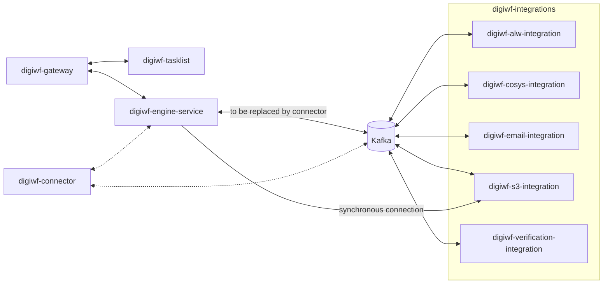
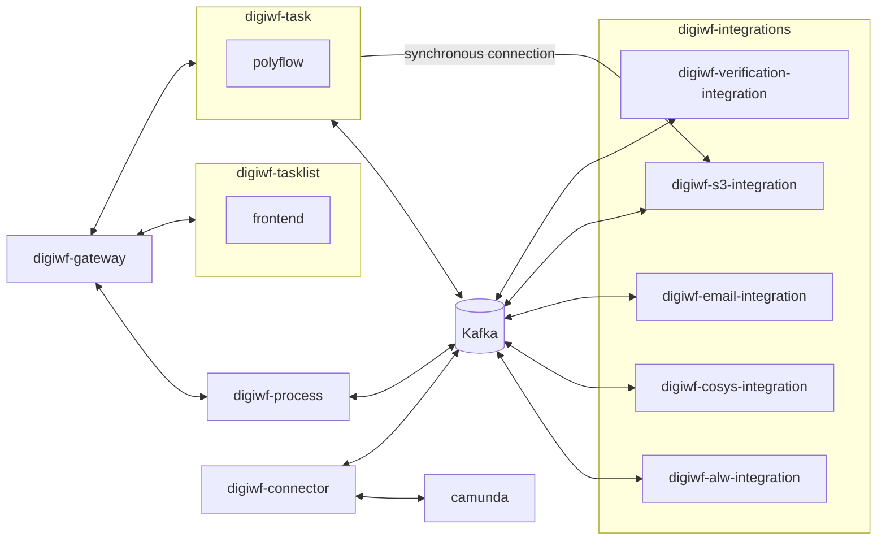

# Development

**Current state**



**Future state**



## Local Setup

For local development you have to start the digiwf-tasklist (the vue and vuetify based frontend application), the
digiwf-engine-service (spring-boot and camunda based backend application) and the digiwf-gateway.
Additionally, you can start the digiwf-integrations if you need features from any of the integration services.

You may run the applications with the default settings (from `application.yml`) and customize the configurations
by adding environment variables. You always have to set the env variable `DIGIWF_ENV` (for local
development `DIGIWF_ENV=local-01`).
Additionally, some services require a few more environment variables.

Under (All env variables)[#all-env-variables] you will find a list of all possible env variables.

### Setup a local dev environment

You can use the docker-compose [stack](stack) to start all the necessary infrastructure components (like e.g. kafka and
minio).
For more information see [here](stack/README.md).

### Tasklist (Frontend)

If you want to develop the frontend you can also use the dev server.

1. Make sure you start the [stack](stack) **without** the tasklist profile (`docker compose up -d`).
2. Go to digiwf-apps
3. Run `npm run serve:tasklist`
    * If the Command fails on the first attempt trigger a build (`npm run build`) and try it again
    * If you want to debug any of the components, run additionally `npm run dev` to auto rebuild the components
4. Go to [localhost:8081](http://localhost:8081)

### DigiWF-Engine (Backend)

Run the [DigiWF-Engine](digiwf-engine/digiwf-engine-service) with the profiles `local`, `streaming`, `no-security`
and `no-ldap`.

Additionally, set the environment variable `DIGIWF_ENV=local-01`.

### API Gateway

Run the [DigiWF-Gateway](digiwf-gateway) with the profiles `local`, `no-security`.

### DigiWF-Integrations

Run the [integrations](digiwf-integrations) you need.
You may run the applications with the default settings, but you probably have to set a few environment variables (
described above).

**Applications and profiles**

To start any of the applications you can use the profiles:

* `local` for local development settings
* `streaming` to enable event streaming to kafka

Additionally, you can use the following profiles to disable a few features to simplify development:

* `no-security` to disable spring security
* `no-mail` to prevent the applications from sending emails
* (only digiwf-engine-service) `no-ldap` to use a *fake* user service instead of the actual lhm ldap

## Tests

### Run Tests

```
mvn clean verify
```

### Jacoco Coverage

The use Jacoco with a maven multi-module project it's recommended to create a dedicated module for the test coverage
generation ([see Jacoco docs](https://github.com/jacoco/jacoco/wiki/MavenMultiModule)).
Therefore, we created the [digiwf-coverage](digiwf-coverage) module which depends on all modules that should get tested.

> If you want to track the test coverage of additional modules you have to add the maven module as dependency
> in [digiwf-coverage](digiwf-coverage/pom.xml).

After executing the tests a jacoco coverage report is generated in [digiwf-coverage](digiwf-coverage) target directory.

## Release a new version

### Building a new maven version

For updating the version of the project we use maven-versions plugin.

#### update new patch version

1. run `mvn versions:set -DprocessAllModules -DnextSnapshot`
2. check if update is correct
3. if update is correct, run `mvn versions:commit` otherwise run `mvn versions:revert`

#### update to a specific version

1. run `mvn versions:set -DprocessAllModules -DnewVersion=<your version>`
2. check if update is correct
3. if update is correct, run `mvn versions:commit` otherwise run `mvn versions:revert`

### Deploy a new maven version

- Execute the release pipeline manually and set `Release services (y/n)?` to `y`
- `-SNAPSHOT` will be removed automatically by the pipeline if `Snapshot build (y/n)?` is set to `n`

### Deploy a new apps version

- execute `npm run versioning` in the digiwf-apps folder
- Execute the release pipeline manually and set `Release apps (y/n)?` to `y`
- `-SNAPSHOT` suffix will be set if `Snapshot build (y/n)?` is set to `y`

## All env variables

| Env variable                           | Example                                                          | Description                                                                |
|----------------------------------------|------------------------------------------------------------------|----------------------------------------------------------------------------|
| DIGIWF_ENV                             | local-01, dev, ...                                               | The environment digiwf runs in                                             |
| DIGIWF_S3_HTTPAPI                      | http://localhost:8086                                            | Url to the http endpoints of the document-storage-service (s3-integration) |
| SSO_BASE_URL                           | http://localhost:8085/auth                                       | Base URL to the sso                                                        |
| SSO_REALM                              | DEPARTMENT-Softwaredevelopment                                   | The realm                                                                  |
| SSO_ISSUER_URL                         | `${SSO_BASE_URL}/realms/${SSO_REALM}`                            | The issuer url                                                             |
| SSO_ENGINE_CLIENT_ID                   | digiwf                                                           | The sso client id of the digiwf-engine application                         |
| SSO_ENGINE_CLIENT_SECRET               |                                                                  | The sso client secret of the digiwf-engine application                     |
| ENGINE_DATASOURCE_URL                  | jdbc:h2:file:~/backenddb;DB_CLOSE_ON_EXIT=FALSE;AUTO_SERVER=TRUE |                                                                            |
| ENGINE_DATASOURCE_USER                 | johndoe                                                          |                                                                            |
| ENGINE_DATASOURCE_PASSWORD             |                                                                  |                                                                            |
| ENGINE_DATABASE_PLATFORM               | org.hibernate.dialect.H2Dialect                                  |                                                                            |
| ENGINE_DATABASE_DRIVERCLASSNAME        | org.h2.Driver                                                    |                                                                            |
| MAIL_PORT                              | 1025                                                             |                                                                            |
| MAIL_HOST                              | localhost                                                        |                                                                            |
| MAIL_USERNAME                          | digiwf@core.com                                                  |                                                                            |
| MAIL_PASSWORD                          |                                                                  |                                                                            |
| KAFKA_BOOTSTRAP_SERVER                 | localhost                                                        |                                                                            |
| KAFKA_BOOTSTRAP_SERVER_PORT            | 29092                                                            |                                                                            |
| KAFKA_SECURITY_PROTOCOL                | SSL                                                              |                                                                            |
| DOCUMENT_STORAGE_HOST                  | http://localhost                                                 | The host of the document storage service  (s3-integration)                 |
| DOCUMENT_STORAGE_PORT                  | 8080                                                             | The port of the document storage service (s3-integration)                  |
| S3_PROXY_HOST                          | localhost                                                        | Host of the s3 proxy service                                               |
| S3_PROXY_PORT                          | 9000                                                             | Port of the s3 proxy service                                               |
| S3_BUCKETNAME                          | my-s3-bucket                                                     | The name of the s3 bucket                                                  |
| S3_ACCESSKEY                           |                                                                  |                                                                            |
| S3_URL                                 | http://localhost:9000                                            |                                                                            |
| S3_SECRETKEY                           |                                                                  |                                                                            |
| S3INTEGRATION_DATASOURCE_URL           | jdbc:h2:mem:testdb;DB_CLOSE_ON_EXIT=FALSE;AUTO_SERVER=TRUE       | The s3 integrations datasource url                                         |
| S3INTEGRATION_DATASOURCE_USER          | johndoe                                                          | The s3 integrations database user                                          |
| S3INTEGRATION_DATASOURCE_PASSWORD      |                                                                  |                                                                            |
| S3INTEGRATION_DATABASE_PLATFORM        | org.hibernate.dialect.H2Dialect                                  |                                                                            |
| S3INTEGRATION_DATABASE_DRIVERCLASSNAME | org.h2.Driver                                                    |                                                                            |
| ADDRESS_INTEGRATION_SERVER_PORT        | 8088                                                             | The address integration services server port                               |
| ADDRESS_SERVICE_URL                    | http://localhost:8089                                            | The url of the Stadt München Address Service                               |

**Legacy EAI Properties**

| Env variable             | Example                | Description |
|--------------------------|------------------------|-------------|
| ALW_DMS_EAIHOST          | http://localhost       |             |
| ALW_DMS_EAIPORT          | 9010                   |             |
| ALW_DMS_UIURL            |                        |             |
| ALW_PERSONENINFO_EAIHOST | http://localhost       |             |
| ALW_PERSONENINFO_EAIPORT | 8091                   |             |
| DIGIWF_FRONTEND_URL      | http://localhost:8081/ |             |
| COSYS_EAIHOST            | http://localhost       |             |
| COSYS_EAIPORT            | 8091                   |             |
| COCKPIT_URL              |                        |             |
| DMS_HOST                 | http://localhost       |             |
| DMS_PORT                 | 8191                   |             |
| DMS_UIURL                |                        |             |
| DMS_USERNAME             | eaiclient              |             |
| PARKAUSWEIS_HOST         | http://localhost       |             |
| PARKAUSWEIS_PORT         | 9011                   |             | 
