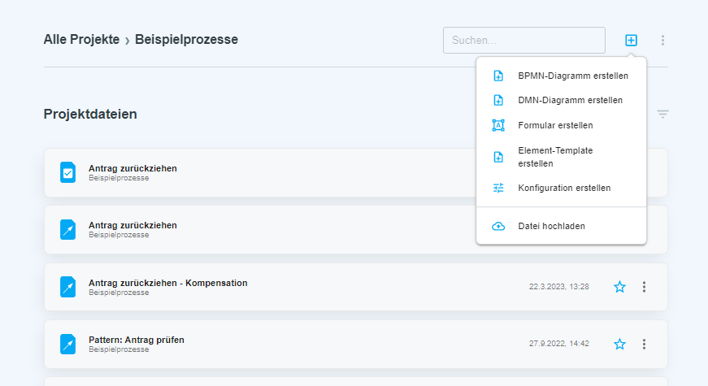

# Artefakte

Die Plattform DigiWF bietet verschiedene Artefakte, die bei der Modellierung von Geschäftsprozessen unterstützen. Im
Folgenden findest du eine kurze Beschreibung der wichtigsten Artefakte:

- BPMN: BPMN steht für "Business Process Model and Notation" und ist eine grafische Notationssprache, die es ermöglicht,
  Geschäftsprozesse visuell darzustellen und zu automatisieren. BPMN-Diagramme können in DigiWF erstellt werden, um
  Prozesse auszuführen.
- DMN: DMN steht für "Decision Model and Notation" und ist eine Notationssprache, die es ermöglicht,
  Entscheidungsmodelle zu modellieren und automatisch auszuwerten. Mit DMN können Entscheidungen innerhalb von
  Prozessen automatisiert werden.
- Formulare: In DigiWF können Formulare erstellt werden, um Daten von Benutzern während der Durchführung eines Prozesses
  zu erfassen. Formulare können in BPMN-Diagrammen mit Benutzeraufgaben und Startereignissen verknüpft werden.
- Prozesskonfiguration: Prozesskonfigurationen ermöglichen es, Prozessparameter und -einstellungen zu definieren und zu
  verwalten. In DigiWF können Prozesskonfigurationen erstellt werden, um die Ausführung von Prozessen zu steuern und
  diese zur Laufzeit zu verwenden.
- Templates: DigiWF bietet eine Vielzahl von Elementvoralgen, die bei der Erstellung neuer Prozesse
  verwendet werden können. Die Vorlagen enthalten bereits BPMN-Diagramme, DMN-Modelle und Anbindungen an Fachverfahren
  und Basisdienste.

::: tip
In einer Co-Creation-Plattform können die verschiedenen Artefakte, die bei der Modellierung von Geschäftsprozessen
verwendet werden, einfach verwaltet werden. Eine Co-Creation-Plattform ermöglicht es mehreren Benutzern, gleichzeitig an
einem Projekt zu arbeiten und die Ergebnisse zu teilen. Dabei können die Artefakte wie BPMN-Diagramme, DMN-Modelle,
Formulare, Prozesskonfigurationen und Templates zentral verwaltet und geteilt werden.
:::

## Artefakt hinzufügen

In einem [Projekt](/modeling/plattform/project/) können verschiedene Artefakte, wie BPMN-Diagramme, DMN-Modelle,
Formulare und Prozesskonfigurationen verwaltet werden.
Um ein neues Artefakt hinzuzufügen, kann im Menü `+` das entsprechende Artefakt ausgewählt werden.

## Artefakt versionieren

Um ein Artefakt zu versionieren, kann ein *Milestone* erstellt werden.
Dies erlaubt es dem Projektteam, verschiedene Entwicklungsstufen des Artefakts zu speichern.
Die Aktion kann im Kontextmenüs des Artefakts ausgeführt werden.

